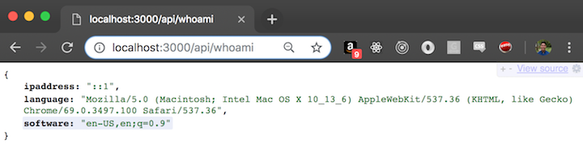

# API Project: Request Header Parser Microservice for freeCodeCamp - Completed

## View on [Glitch](https://peat-freckle.glitch.me/)

## Endpoints created:

GET /api/whoami which you can visit [here](https://peat-freckle.glitch.me/api/whoami)



## To run this project locally

1. Https or SSH download this project.
2. `npm install`
3. navigate to localhost:3000/api/timestamp

## User stories:

1. I can get the IP address, preferred languages (from header `Accept-Language`) and system infos (from header `User-Agent`) for my device.

#### Example usage:

- [base_url]/api/whoami

#### Example output:

```
{
  "ipaddress":"159.20.14.100",
  "language":"en-US,en;q=0.5",
  "software":"Mozilla/5.0 (X11; Ubuntu; Linux x86_64; rv:50.0) Gecko/20100101 Firefox/50.0"
}
```
